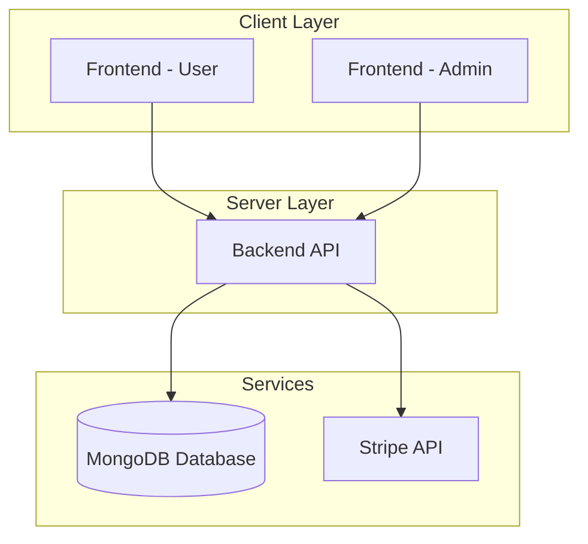
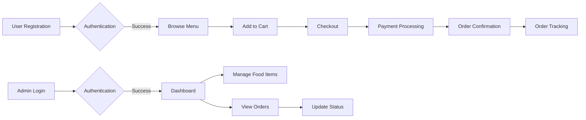

# 🍔 Restaurant Management System

[](LICENSE)
[](https://nodejs.org/)
[](https://reactjs.org/)
[](https://www.mongodb.com/)
[](https://expressjs.com/)

A full-stack food delivery web application built with the MERN stack (MongoDB, Express.js, React, Node.js) featuring user authentication, shopping cart, online payments via Stripe, and an admin dashboard.

## 🌟 Features

| Feature | Description |
|--------|-------------|
| **User Authentication** | Secure registration and login system with JWT tokens |
| **Shopping Cart** | Add/remove items, adjust quantities, real-time price calculation |
| **Online Payments** | Integrated Stripe payment gateway for secure transactions |
| **Order Tracking** | Real-time order status updates from preparation to delivery |
| **Admin Dashboard** | Manage food items, view orders, update order statuses |
| **Responsive Design** | Mobile-friendly interface for all device sizes |

## 🏗️ Architecture



## 📁 Project Structure

```
Restaurant-Management-System/
├── frontend/          # User-facing application
├── admin/             # Admin dashboard
├── backend/           # Server logic and API
└── README.md          # Project documentation
```

## 🚀 Quick Start

### Prerequisites
- Node.js (v18 or higher)
- MongoDB Atlas account or local MongoDB instance
- Stripe account for payment processing

### Installation

1. **Clone the repository:**
   ```bash
   git clone https://github.com/your-username/restaurant-management-system.git
   cd restaurant-management-system
   ```

2. **Install dependencies for all modules:**
   ```bash
   # Backend
   cd backend
   npm install
   
   # Frontend
   cd ../frontend
   npm install
   
   # Admin
   cd ../admin
   npm install
   ```

3. **Configure environment variables:**
   Copy `.env.example` to `.env` in each directory and update with your credentials.

4. **Run the application:**
   ```bash
   # Start backend server
   cd backend
   npm run server
   
   # Start frontend
   cd ../frontend
   npm run dev
   
   # Start admin panel
   cd ../admin
   npm run dev
   ```

## 📦 Tech Stack

| Layer | Technology | Purpose |
|-------|------------|---------|
| **Frontend** | React 18 | User interface |
| **Frontend** | Vite | Build tool |
| **Frontend** | React Router | Navigation |
| **Admin** | React 18 | Admin dashboard |
| **Admin** | Vite | Build tool |
| **Backend** | Node.js | Runtime environment |
| **Backend** | Express.js | Web framework |
| **Database** | MongoDB | Data storage |
| **Database** | Mongoose | ODM |
| **Authentication** | JWT | Token-based auth |
| **Payments** | Stripe | Payment processing |

## 🖼️ Screenshots

### User Interface


### Admin Dashboard


## 🔄 Workflow



## 🛠️ API Endpoints

| Method | Endpoint | Description |
|--------|----------|-------------|
| POST | `/api/user/register` | User registration |
| POST | `/api/user/login` | User login |
| GET | `/api/food/list` | Get all food items |
| POST | `/api/cart/add` | Add item to cart |
| POST | `/api/order/place` | Place order |
| GET | `/api/order/userorders` | Get user orders |

## 🤝 Contributing

1. Fork the repository
2. Create your feature branch (`git checkout -b feature/AmazingFeature`)
3. Commit your changes (`git commit -m 'Add some AmazingFeature'`)
4. Push to the branch (`git push origin feature/AmazingFeature`)
5. Open a Pull Request

## 📄 License

This project is licensed under the MIT License - see the [LICENSE](LICENSE) file for details.

## 👤 Author

**Mausam Kar**
- Portfolio: [mausam03.vercel.app](https://mausam03.vercel.app)
- GitHub: [@mausam03](https://github.com/mausam03)

## 🙏 Acknowledgments

- [React](https://reactjs.org/) for the frontend library
- [Node.js](https://nodejs.org/) for the runtime environment
- [MongoDB](https://www.mongodb.com/) for the database
- [Stripe](https://stripe.com/) for payment processing