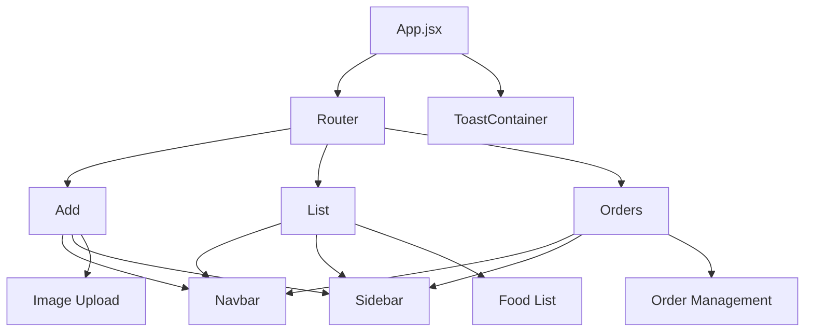
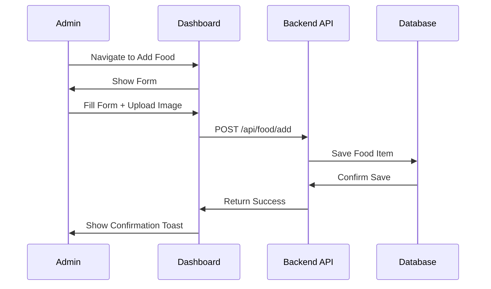

# 🛠️ Admin Dashboard

[](https://reactjs.org/)
[](https://vitejs.dev/)
[](../../LICENSE)

The administrative dashboard for the Restaurant Management System, allowing administrators to manage food items, view orders, and update order statuses.

## 🌟 Features

| Feature | Description |
|--------|-------------|
| **Food Management** | Add, edit, and remove food items |
| **Order Tracking** | View all orders with status updates |
| **Image Upload** | Upload food images with preview |
| **User Management** | View registered users (read-only) |
| **Dashboard Analytics** | Overview of sales and orders |
| **Responsive Design** | Works on desktop and tablet devices |

## 🏗️ Architecture



## 📁 Project Structure

```
admin/
├── src/
│   ├── assets/           # Images and static assets
│   ├── components/       # Reusable UI components
│   │   ├── Navbar/       # Top navigation bar
│   │   └── Sidebar/      # Side navigation menu
│   ├── pages/            # Main admin pages
│   │   ├── Add/          # Add new food items
│   │   ├── List/         # Manage existing food items
│   │   └── Orders/       # View and manage orders
│   ├── App.jsx           # Main application component
│   └── main.jsx          # Application entry point
├── index.html            # HTML template
└── vite.config.js        # Vite configuration
```

## 🚀 Quick Start

### Prerequisites
- Node.js (v18 or higher)
- Backend server running

### Installation

1. **Navigate to admin directory:**
   ```bash
   cd admin
   ```

2. **Install dependencies:**
   ```bash
   npm install
   ```

3. **Start development server:**
   ```bash
   npm run dev
   ```

4. **Build for production:**
   ```bash
   npm run build
   ```

## 📦 Dependencies

### Core Dependencies
| Package | Version | Purpose |
|---------|---------|---------|
| react | ^18.3.1 | UI library |
| react-dom | ^18.3.1 | DOM rendering |
| react-router-dom | ^6.24.1 | Client-side routing |
| axios | ^1.7.2 | HTTP client |
| react-toastify | ^10.0.5 | Notification system |

### Development Dependencies
| Package | Version | Purpose |
|---------|---------|---------|
| vite | ^5.3.1 | Build tool |
| @vitejs/plugin-react | ^4.3.1 | React plugin for Vite |
| eslint | ^8.57.0 | Code linting |

## 🎨 Component Overview

### Pages
| Component | Path | Description |
|----------|------|-------------|
| Add | `/add` | Add new food items with image upload |
| List | `/list` | View and edit existing food items |
| Orders | `/orders` | Manage customer orders and status |

### Components
| Component | Description |
|----------|-------------|
| Navbar | Top navigation with app title |
| Sidebar | Side menu with page links |

## 🔄 Data Flow



## 🛠️ Environment Variables

Create a `.env` file in the admin directory:

```env
VITE_BACKEND_URL=http://localhost:4000
```

## 🔐 Authentication

The admin dashboard requires authentication to access. Users must have admin privileges to use the dashboard.

### Protected Routes
- `/add` - Add new food items
- `/list` - Manage food items
- `/orders` - View and manage orders

## 📱 Responsive Design

| Breakpoint | Devices | Features |
|------------|---------|----------|
| < 768px | Mobile | Limited functionality |
| 768px - 1024px | Tablet | Full functionality |
| > 1024px | Desktop | Optimized layout |

## 🤝 Integration Points

| Service | Endpoint | Purpose |
|---------|----------|---------|
| Backend API | `http://localhost:4000/api` | Data management |
| File Upload | `http://localhost:4000/images` | Image storage |

## 🐛 Debugging

### Common Issues

1. **API Connection Failed**
   - Check if backend server is running
   - Verify `VITE_BACKEND_URL` in `.env`

2. **Image Upload Failed**
   - Check file size limits
   - Verify upload directory permissions

3. **Data Not Loading**
   - Clear browser cache
   - Check browser console for errors

## 📈 Performance

- **Bundle Size**: Optimized with Vite
- **Load Time**: < 1.5 seconds on modern connections
- **Caching**: Implemented via service workers

## 📊 Dashboard Analytics

The dashboard provides key metrics:
- Total orders
- Revenue overview
- Popular food items
- Order status distribution

## 📄 License

This project is licensed under the MIT License - see the [LICENSE](../../LICENSE) file for details.

## 👤 Author

**Mausam Kar**
- Portfolio: [mausam03.vercel.app](https://mausam03.vercel.app)
- GitHub: [@mausam03](https://github.com/mausam03)