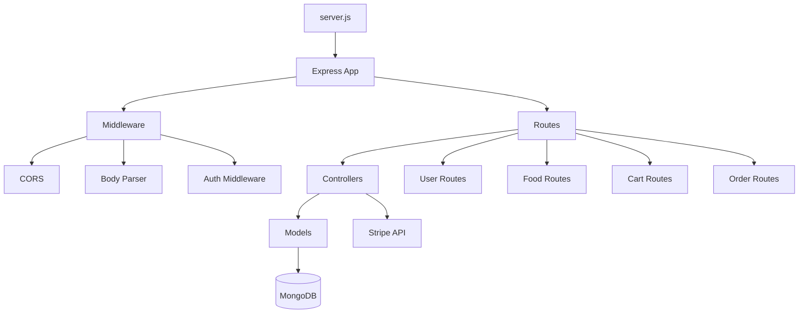
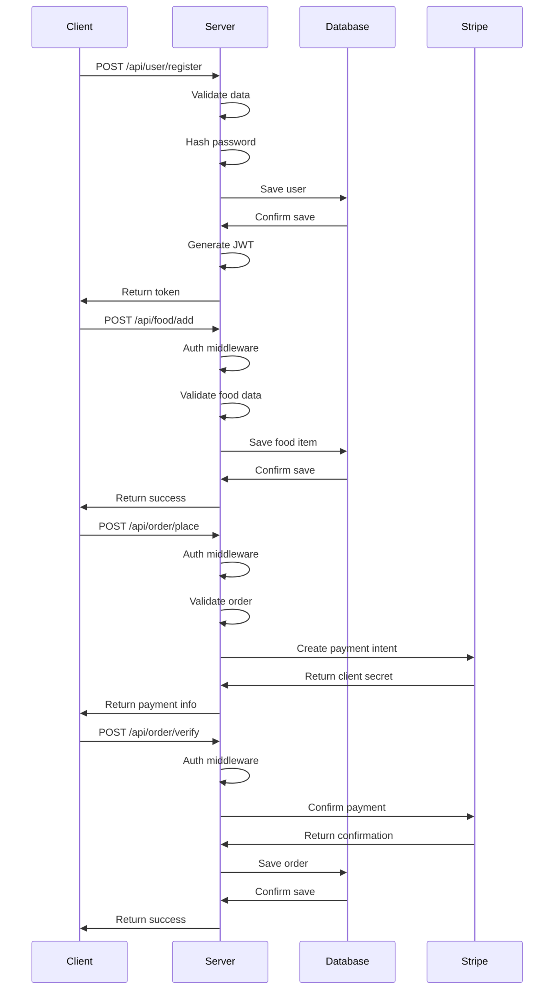
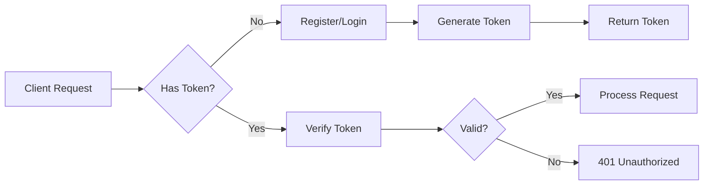

# ⚙️ Backend API Server

[](https://nodejs.org/)
[](https://expressjs.com/)
[](https://www.mongodb.com/)
[](../../LICENSE)

The backend server for the Restaurant Management System, built with Node.js and Express, providing RESTful APIs for user authentication, food management, cart operations, and order processing.

## 🌟 Features

| Feature | Description |
|--------|-------------|
| **RESTful API** | Clean, well-documented API endpoints |
| **User Authentication** | JWT-based authentication with bcrypt hashing |
| **Food Management** | CRUD operations for food items |
| **Cart Operations** | Add, remove, and update cart items |
| **Order Processing** | Place orders with Stripe integration |
| **Order Management** | Track and update order statuses |
| **Image Upload** | Multer-based file upload for food images |

## 🏗️ Architecture



## 📁 Project Structure

```
backend/
├── config/              # Database configuration
├── controllers/         # Business logic
├── middleware/          # Authentication middleware
├── models/              # Database models
├── routes/              # API route definitions
├── uploads/             # Uploaded images
├── .env                 # Environment variables
├── server.js            # Entry point
└── package.json         # Dependencies
```

## 🚀 Quick Start

### Prerequisites
- Node.js (v18 or higher)
- MongoDB Atlas account or local MongoDB instance
- Stripe account for payment processing

### Installation

1. **Navigate to backend directory:**
   ```bash
   cd backend
   ```

2. **Install dependencies:**
   ```bash
   npm install
   ```

3. **Configure environment variables:**
   Copy `.env.example` to `.env` and update with your credentials:
   ```bash
   cp .env.example .env
   ```

4. **Start development server:**
   ```bash
   npm run server
   ```

## 📦 Dependencies

### Core Dependencies
| Package | Version | Purpose |
|---------|---------|---------|
| express | ^4.19.2 | Web framework |
| mongoose | ^8.4.4 | MongoDB ODM |
| bcrypt | ^5.1.1 | Password hashing |
| jsonwebtoken | ^9.0.2 | JWT authentication |
| cors | ^2.8.5 | Cross-origin resource sharing |
| multer | ^1.4.5-lts.1 | File upload |
| stripe | ^16.1.0 | Payment processing |
| dotenv | ^16.4.5 | Environment variables |
| validator | ^13.12.0 | Data validation |

### Development Dependencies
| Package | Version | Purpose |
|---------|---------|---------|
| nodemon | ^3.1.4 | Auto-restart server |

## 🛠️ API Endpoints

### User Authentication
| Method | Endpoint | Description |
|--------|----------|-------------|
| POST | `/api/user/register` | Register new user |
| POST | `/api/user/login` | User login |

### Food Management
| Method | Endpoint | Description |
|--------|----------|-------------|
| GET | `/api/food/list` | Get all food items |
| POST | `/api/food/add` | Add new food item |
| POST | `/api/food/remove` | Remove food item |

### Cart Operations
| Method | Endpoint | Description |
|--------|----------|-------------|
| POST | `/api/cart/add` | Add item to cart |
| POST | `/api/cart/remove` | Remove item from cart |
| POST | `/api/cart/get` | Get user's cart items |

### Order Processing
| Method | Endpoint | Description |
|--------|----------|-------------|
| POST | `/api/order/place` | Place new order |
| POST | `/api/order/verify` | Verify payment |
| POST | `/api/order/userorders` | Get user's orders |
| GET | `/api/order/list` | Get all orders (admin) |
| POST | `/api/order/status` | Update order status (admin) |

## 🔄 Data Flow



## 🗄️ Database Schema

### User Model
```javascript
{
  name: String,
  email: String (unique),
  password: String (hashed),
  date: Date (default: now)
}
```

### Food Model
```javascript
{
  name: String,
  description: String,
  price: Number,
  image: String,
  category: String,
  date: Date (default: now)
}
```

### Cart Model
```javascript
{
  userId: String,
  items: [{
    itemId: String,
    quantity: Number
  }]
}
```

### Order Model
```javascript
{
  userId: String,
  items: [Object],
  amount: Number,
  address: Object,
  status: String,
  date: Date (default: now),
  payment: Boolean
}
```

## 🔐 Authentication Flow



## 🛠️ Environment Variables

Create a `.env` file in the backend directory:

```env
MONGODB_URI=your_mongodb_connection_string
JWT_SECRET=your_jwt_secret_key
STRIPE_SECRET_KEY=your_stripe_secret_key
PORT=4000
```

## 📱 Middleware

| Middleware | Purpose |
|------------|---------|
| CORS | Enable cross-origin requests |
| Body Parser | Parse request bodies |
| Auth | JWT token verification |
| Multer | Handle file uploads |

## 🐛 Debugging

### Common Issues

1. **Database Connection Failed**
   - Check `MONGODB_URI` in `.env`
   - Verify MongoDB Atlas IP whitelist
   - Ensure network connectivity

2. **JWT Verification Failed**
   - Check `JWT_SECRET` in `.env`
   - Verify token expiration

3. **Stripe Payment Failed**
   - Check `STRIPE_SECRET_KEY` in `.env`
   - Verify Stripe account status

## 📈 Performance

- **Response Time**: < 200ms for most endpoints
- **Concurrency**: Handles 100+ concurrent requests
- **Caching**: Implemented for static assets

## 📊 Monitoring

The server includes basic logging for:
- Request tracking
- Error reporting
- Performance metrics

## 📄 License

This project is licensed under the MIT License - see the [LICENSE](../../LICENSE) file for details.

## 👤 Author

**Mausam Kar**
- Portfolio: [mausam03.vercel.app](https://mausam03.vercel.app)
- GitHub: [@mausam03](https://github.com/mausam03)