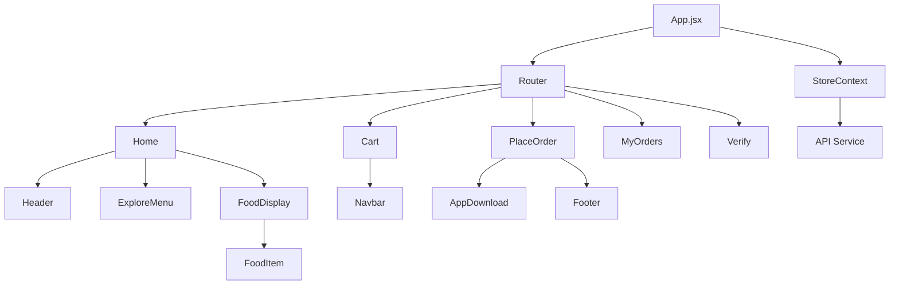
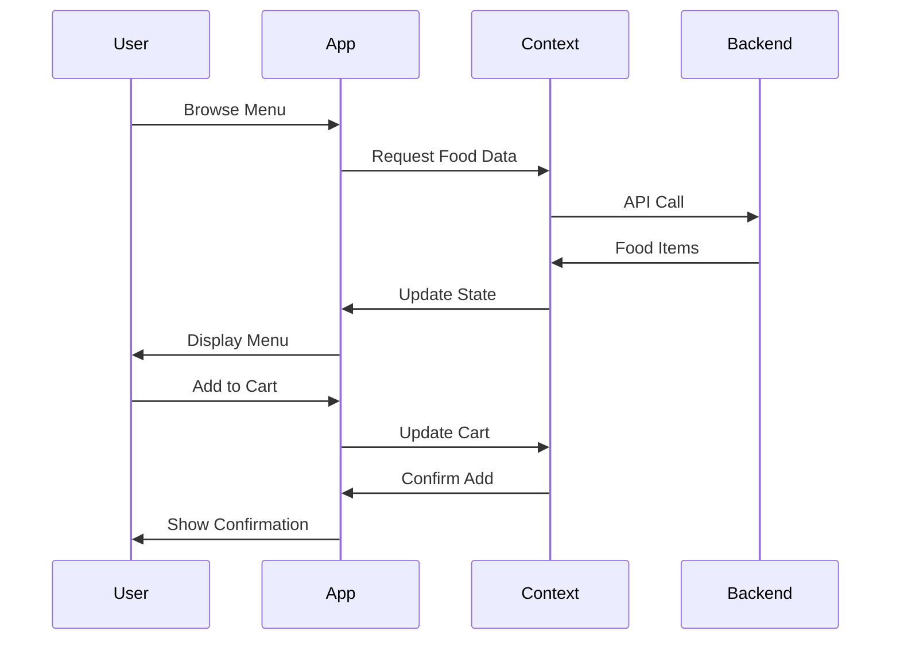

# 🍽️ Frontend - User Application

[](https://reactjs.org/)
[](https://vitejs.dev/)
[](../../LICENSE)

The user-facing application of the Restaurant Management System, built with React and Vite for a fast, responsive experience.

## 🌟 Features

| Feature | Description |
|--------|-------------|
| **Home Page** | Attractive landing page with featured items |
| **Food Menu** | Browse categorized food items with descriptions |
| **Shopping Cart** | Add/remove items, adjust quantities, real-time pricing |
| **User Authentication** | Register, login, and session management |
| **Order Placement** | Secure checkout with address and payment details |
| **Order History** | View past orders and their status |
| **Responsive Design** | Mobile-first design for all device sizes |

## 🏗️ Architecture



## 📁 Project Structure

```
frontend/
├── src/
│   ├── assets/           # Images and static assets
│   ├── components/       # Reusable UI components
│   │   ├── AppDownload/  # App download section
│   │   ├── ExploreMenu/  # Menu navigation
│   │   ├── FoodDisplay/  # Food listing container
│   │   ├── FoodItem/     # Individual food item
│   │   ├── Footer/       # Page footer
│   │   ├── Header/       # Navigation header
│   │   ├── LoginPopup/   # Authentication modal
│   │   └── Navbar/       # Top navigation
│   ├── context/          # React context for state management
│   ├── pages/            # Main application pages
│   │   ├── Cart/         # Shopping cart page
│   │   ├── Home/         # Main landing page
│   │   ├── MyOrders/     # User order history
│   │   ├── PlaceOrder/   # Checkout process
│   │   └── Verify/       # Payment verification
│   ├── App.jsx           # Main application component
│   └── main.jsx          # Application entry point
├── index.html            # HTML template
└── vite.config.js        # Vite configuration
```

## 🚀 Quick Start

### Prerequisites
- Node.js (v18 or higher)
- Backend server running

### Installation

1. **Navigate to frontend directory:**
   ```bash
   cd frontend
   ```

2. **Install dependencies:**
   ```bash
   npm install
   ```

3. **Start development server:**
   ```bash
   npm run dev
   ```

4. **Build for production:**
   ```bash
   npm run build
   ```

## 📦 Dependencies

### Core Dependencies
| Package | Version | Purpose |
|---------|---------|---------|
| react | ^18.2.0 | UI library |
| react-dom | ^18.2.0 | DOM rendering |
| react-router-dom | ^6.23.1 | Client-side routing |
| axios | ^1.7.2 | HTTP client |

### Development Dependencies
| Package | Version | Purpose |
|---------|---------|---------|
| vite | ^5.2.0 | Build tool |
| @vitejs/plugin-react | ^4.2.1 | React plugin for Vite |
| eslint | ^8.57.0 | Code linting |

## 🎨 Component Overview

### Pages
| Component | Path | Description |
|----------|------|-------------|
| Home | `/` | Main landing page with menu |
| Cart | `/cart` | Shopping cart management |
| PlaceOrder | `/place-order` | Checkout process |
| MyOrders | `/my-orders` | Order history |
| Verify | `/verify` | Payment verification |

### Components
| Component | Description |
|----------|-------------|
| Header | Navigation bar with logo and cart |
| ExploreMenu | Category filter for food items |
| FoodDisplay | Grid layout for food items |
| FoodItem | Individual food card with image and details |
| LoginPopup | Authentication modal |
| AppDownload | Mobile app promotion |
| Footer | Site footer with links |

## 🔄 Data Flow



## 🛠️ Environment Variables

Create a `.env` file in the frontend directory:

```env
VITE_BACKEND_URL=http://localhost:4000
VITE_STRIPE_PUBLIC_KEY=pk_test_your_stripe_key
```

## 📱 Responsive Design

The frontend is built with a mobile-first approach:

| Breakpoint | Devices | Features |
|------------|---------|----------|
| < 640px | Mobile | Single column layout |
| 640px - 1024px | Tablet | Two column layout |
| > 1024px | Desktop | Multi-column layout |

## 🤝 Integration Points

| Service | Endpoint | Purpose |
|---------|----------|---------|
| Backend API | `http://localhost:4000/api` | Data and authentication |
| Stripe | `https://api.stripe.com` | Payment processing |

## 🐛 Debugging

### Common Issues

1. **API Connection Failed**
   - Check if backend server is running
   - Verify `VITE_BACKEND_URL` in `.env`

2. **Images Not Loading**
   - Ensure assets are in the correct directory
   - Check file paths in components

3. **Cart Not Updating**
   - Clear browser cache
   - Check browser console for errors

## 📈 Performance

- **Bundle Size**: Optimized with Vite
- **Load Time**: < 2 seconds on modern connections
- **Caching**: Implemented via service workers

## 📄 License

This project is licensed under the MIT License - see the [LICENSE](../../LICENSE) file for details.

## 👤 Author

**Mausam Kar**
- Portfolio: [mausam03.vercel.app](https://mausam03.vercel.app)
- GitHub: [@mausam03](https://github.com/mausam03)